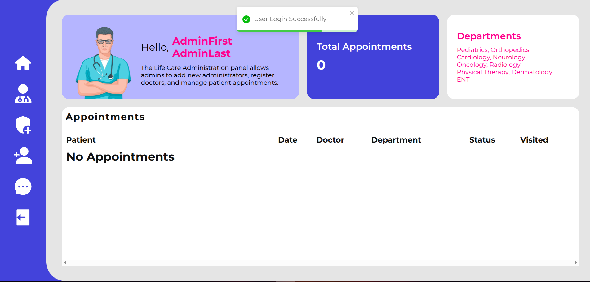

# Hospital Management System - Full Stack Project

This project is a comprehensive **Hospital Management System** featuring a responsive design for both administrators and patients. It includes a backend service and two separate frontend implementations for managing hospital operations and patient interactions.

## Screenshot




## Features

### Admin Panel

- **Doctor Management**: Register and manage doctor profiles.
- **Admin Management**: Add new administrators.
- **Appointment Management**: View, approve, or reject patient appointments.
- **Patient Messages**: Read and respond to patient messages.

### Patient Portal

- **Registration and Login**: Patients can register and log in.
- **Appointment Booking**: Schedule appointments with doctors, including patient details and date.
- **Message Sending**: Send messages to the admin.
- **Hospital Information**: Learn about Life Care Hospital.

## Project Structure

The project is organized into the following main folders:

- **Backend**: Contains the server-side code for handling API requests, authentication, and database interactions.
- **Frontend-Admin**: The responsive frontend for hospital administrators.
- **Frontend-Patient**: The responsive frontend for patients.

### Backend

The backend is built using Node.js and Express, and it includes:

- **Dependencies**: `bcrypt`, `cloudinary`, `cookie-parser`, `cors`, `dotenv`, `express`, `express-fileupload`, `jsonwebtoken`, `sequelize`, `validator`.
- **Features**: Error handling, input validation, token generation, and user schemas.

### Frontend - Admin

The admin panel is built with React.js and provides a responsive interface for managing hospital operations.

### Frontend - Patient

The patient portal is also built with React.js, offering a responsive design for patient interactions.

## Technologies Used

- **Frontend**: React.js, Bootstrap, Axios
- **Backend**: Node.js, Express, PGSQL, JWT, Bcrypt
- **Other**: Cloudinary for image uploads, dotenv for environment variables, cookie-parser for handling cookies.

## Getting Started

To get started with the project, follow these instructions:

### Prerequisites

- Node.js and npm (Node Package Manager) installed on your system.
- A running backend server (see the backend section for setup instructions).

### Installation

1. **Clone the repository:**

   ```bash
    git clone https://github.com/ahmedmst2423/Hospital-Management-System.git
   ```

   - First open Hospital-Management-System folder:

   ```bash
   cd Hospital-Management-System
   ```

2. **Navigate to each folder and install dependencies:**

   - For Backend:

     ```bash
     cd Backend
     npm install
     ```

   - For Frontend-Admin:

     ```bash
     cd Frontend-Admin
     npm install
     ```

   - For Frontend-Patient:
     ```bash
     cd Frontend-Patient
     npm install
     ```

### Running the Application

1. **Start the Backend server:**

   ```bash
   cd Backend
   npm run dev
   ```

2. **Start the Frontend-Admin application:**

   ```bash
   cd Frontend-Admin
   npm run dev
   ```

3. **Start the Frontend-Patient application:**

   ```bash
   cd Frontend-Patient
   npm run dev
   ```

4. **Open your browser and navigate to:**
   - Admin Panel: [http://localhost:5174](http://localhost:5174)
   - Patient Portal: [http://localhost:5175](http://localhost:5175)

### Environment Variables

Ensure you have the following environment variables set in your `.env` file for the backend:

- `PORT`: The port number for the backend server.
- `DB_URI`: The Postgresql connection string.
- `JWT_SECRET_KEY`: Secret key for JWT.
- `JWT_EXPIRES`: JWT expiration time.
- `CLOUDINARY_CLOUD_NAME`: Cloudinary cloud name for image storage.
- `CLOUDINARY_API_KEY`: Cloudinary API key.
- `CLOUDINARY_API_SECRET`: Cloudinary API secret.

### Creating an Admin User

1. **Register a new patient user** by following the registration process on the Patient Portal.
2. **Update the user's role** to "Admin" directly in the database:
   - Open your PGSQL client.
   - Find the `users` collection in your database.
   - Locate the user document with the role of "Patient" that you registered.
   - Update the `role` field from "Patient" to "Admin".
